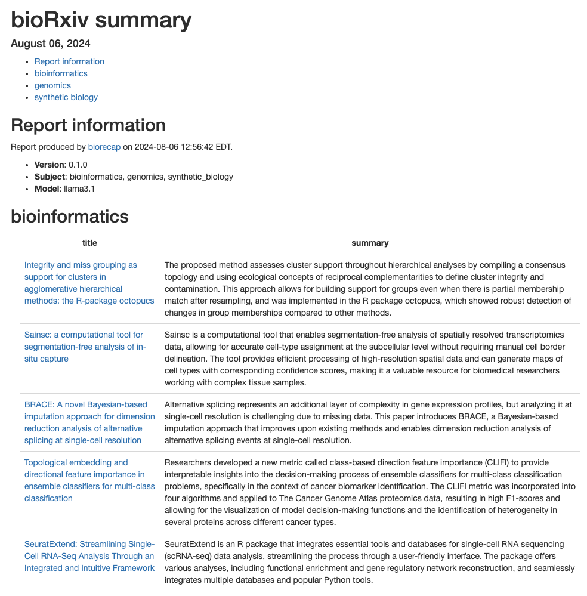

<!-- README.md is generated from README.Rmd. Please edit that file -->

# biorecap

<!-- badges: start -->

[](https://github.com/stephenturner/biorecap/actions/workflows/R-CMD-check.yaml)
<!-- badges: end -->

Retrieve and summarize [bioRxiv](https://www.biorxiv.org/) preprints
using a local LLM through [Ollama](https://ollama.com/).

## Installation

Install biorecap from GitHub (keep `dependencies=TRUE` to get Suggests
packages needed to create the HTML report):

``` r
remotes::install_github("stephenturner/biorecap", dependencies=TRUE)
```

## Example

### Quick start

First, load the biorecap library.

``` r
library(biorecap)
```

Let’s make sure Ollama is running and that we can talk to it through R:

``` r
test_connection()
```

    #> Ollama local server running
    #> <httr2_response>
    #> GET http://localhost:11434/
    #> Status: 200 OK
    #> Content-Type: text/plain
    #> Body: In memory (17 bytes)

Next we can list our available models:

``` r
list_models()
```

    #> # A tibble: 2 × 4
    #>   name            model           parameter_size quantization_level
    #>   <chr>           <chr>           <chr>          <chr>             
    #> 1 llama3.1:latest llama3.1:latest 8.0B           Q4_0              
    #> 2 llama3.1:70b    llama3.1:70b    70.6B          Q4_0

Write an HTML report containing summaries of recent preprints in select
subject areas to the current working directory.

``` r
biorecap_report(output_dir=".", 
                subject=c("bioinformatics", "genomics", "synthetic_biology"), 
                model="llama3.1")
```

Example HTML report generated from the bioRxiv RSS feed on August 6,
2024:



### Details

The `get_preprints()` function retrieves preprints from bioRxiv’s RSS
feeds. You pass one or more subjects to the `subject` argument.

``` r
pp <- get_preprints(subject=c("bioinformatics", 
                              "genomics", 
                              "synthetic_biology"))
pp
```

    #> # A tibble: 90 × 4
    #>    subject        title                                           url   abstract
    #>    <chr>          <chr>                                           <chr> <chr>   
    #>  1 bioinformatics Integrity and miss grouping as support for clu… http… "The hi…
    #>  2 bioinformatics Sainsc: a computational tool for segmentation-… http… "Spatia…
    #>  3 bioinformatics BRACE: A novel Bayesian-based imputation appro… http… "Bayesi…
    #>  4 bioinformatics Topological embedding and directional feature … http… "Cancer…
    #>  5 bioinformatics SeuratExtend: Streamlining Single-Cell RNA-Seq… http… "Single…
    #>  6 bioinformatics An Evolutionary Statistics Toolkit for Simplif… http… "We pre…
    #>  7 bioinformatics A map of integrated cis-regulatory elements en… http… "Cis-re…
    #>  8 bioinformatics MOSTPLAS: A Self-correction Multi-label Learni… http… "Plasmi…
    #>  9 bioinformatics Bootstrap Evaluation of Association Matrices (… http… "Motiva…
    #> 10 bioinformatics Thermodynamic modeling of Csr/Rsm- RNA interac… http… "Backgr…
    #> # ℹ 80 more rows

The `add_prompt()` function adds a prompt to each preprint that will be
used to prompt the model.

``` r
pp <- pp |> add_prompt()
pp
```

    #> # A tibble: 90 × 5
    #>    subject        title                                    url   abstract prompt
    #>    <chr>          <chr>                                    <chr> <chr>    <chr> 
    #>  1 bioinformatics Integrity and miss grouping as support … http… "The hi… "I am…
    #>  2 bioinformatics Sainsc: a computational tool for segmen… http… "Spatia… "I am…
    #>  3 bioinformatics BRACE: A novel Bayesian-based imputatio… http… "Bayesi… "I am…
    #>  4 bioinformatics Topological embedding and directional f… http… "Cancer… "I am…
    #>  5 bioinformatics SeuratExtend: Streamlining Single-Cell … http… "Single… "I am…
    #>  6 bioinformatics An Evolutionary Statistics Toolkit for … http… "We pre… "I am…
    #>  7 bioinformatics A map of integrated cis-regulatory elem… http… "Cis-re… "I am…
    #>  8 bioinformatics MOSTPLAS: A Self-correction Multi-label… http… "Plasmi… "I am…
    #>  9 bioinformatics Bootstrap Evaluation of Association Mat… http… "Motiva… "I am…
    #> 10 bioinformatics Thermodynamic modeling of Csr/Rsm- RNA … http… "Backgr… "I am…
    #> # ℹ 80 more rows

Let’s take a look at one of these prompts:

> I am giving you a paper’s title and abstract. Summarize the paper in
> as many sentences as I instruct. Do not include any preamble text.
> Just give me the summary.
>
> Number of sentences in summary: 2
>
> Title: SeuratExtend: Streamlining Single-Cell RNA-Seq Analysis Through
> an Integrated and Intuitive Framework
>
> Abstract: Single-cell RNA sequencing (scRNA-seq) has revolutionized
> the study of cellular heterogeneity, but the rapid expansion of
> analytical tools has proven to be both a blessing and a curse,
> presenting researchers with significant challenges. Here, we present
> SeuratExtend, a comprehensive R package built upon the widely adopted
> Seurat framework, which streamlines scRNA-seq data analysis by
> integrating essential tools and databases. SeuratExtend offers a
> user-friendly and intuitive interface for performing a wide range of
> analyses, including functional enrichment, trajectory inference, gene
> regulatory network reconstruction, and denoising. The package
> seamlessly integrates multiple databases, such as Gene Ontology and
> Reactome, and incorporates popular Python tools like scVelo, Palantir,
> and SCENIC through a unified R interface. SeuratExtend enhances data
> visualization with optimized plotting functions and carefully curated
> color schemes, ensuring both aesthetic appeal and scientific rigor. We
> demonstrate SeuratExtend’s performance through case studies
> investigating tumor-associated high-endothelial venules and
> autoinflammatory diseases, and showcase its novel applications in
> pathway-Level analysis and cluster annotation. SeuratExtend empowers
> researchers to harness the full potential of scRNA-seq data, making
> complex analyses accessible to a wider audience. The package, along
> with comprehensive documentation and tutorials, is freely available at
> GitHub, providing a valuable resource for the single-cell genomics
> community.

The `add_summary()` function uses a locally running LLM available
through Ollama to summarize the preprint. Let’s add the summary. Notice
that we can do this all in a single pipeline. This takes a few minutes!

``` r
pp <- 
  get_preprints(subject=c("bioinformatics", "genomics", "synthetic_biology")) |> 
  add_prompt() |> 
  add_summary(model="llama3.1")
```

Let’s take a look at the results:

``` r
pp
#> # A tibble: 90 × 6
#>    subject        title                            url   abstract prompt summary
#>    <chr>          <chr>                            <chr> <chr>    <chr>  <chr>  
#>  1 bioinformatics Integrity and miss grouping as … http… "The hi… "I am… "The p…
#>  2 bioinformatics Sainsc: a computational tool fo… http… "Spatia… "I am… "Sains…
#>  3 bioinformatics BRACE: A novel Bayesian-based i… http… "Bayesi… "I am… "Alter…
#>  4 bioinformatics Topological embedding and direc… http… "Cancer… "I am… "Resea…
#>  5 bioinformatics SeuratExtend: Streamlining Sing… http… "Single… "I am… "Seura…
#>  6 bioinformatics An Evolutionary Statistics Tool… http… "We pre… "I am… "The \…
#>  7 bioinformatics A map of integrated cis-regulat… http… "Cis-re… "I am… "The a…
#>  8 bioinformatics MOSTPLAS: A Self-correction Mul… http… "Plasmi… "I am… "Plasm…
#>  9 bioinformatics Bootstrap Evaluation of Associa… http… "Motiva… "I am… "The a…
#> 10 bioinformatics Thermodynamic modeling of Csr/R… http… "Backgr… "I am… "Resea…
#> # ℹ 80 more rows
```

Let’s look at one of those summaries. Here’s the summary for the
SeuratExtend paper (abstract above):

> SeuratExtend is an R package that integrates essential tools and
> databases for single-cell RNA sequencing (scRNA-seq) data analysis,
> streamlining the process through a user-friendly interface. The
> package offers various analyses, including functional enrichment and
> gene regulatory network reconstruction, and seamlessly integrates
> multiple databases and popular Python tools.

The `biorecap_report()` function runs this code in an RMarkdown
template, writing the resulting HTML and CSV file with results to the
current working directory.

``` r
biorecap_report(output_dir=".", 
                subject=c("bioinformatics", "genomics", "synthetic_biology"), 
                model="llama3.1")
```
