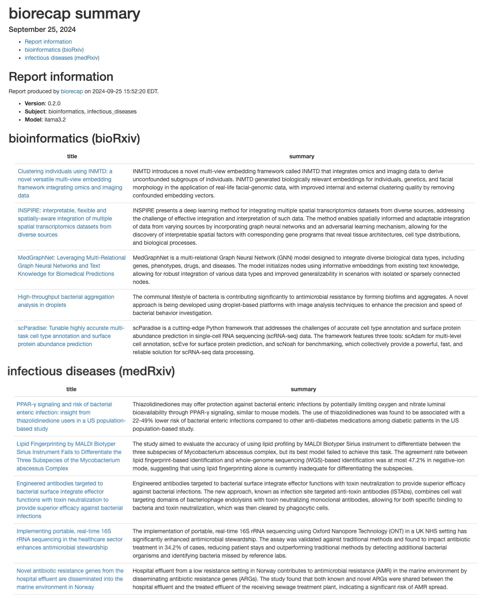

<!-- README.md is generated from README.Rmd. Please edit that file -->

# biorecap <a href='https://github.com/stephenturner/biorecap'></a>

<!-- badges: start -->

[](https://github.com/stephenturner/biorecap/actions/workflows/R-CMD-check.yaml)
[](https://doi.org/10.48550/arXiv.2408.11707)
[](https://stephenturner.r-universe.dev/biorecap)
<!-- badges: end -->

Retrieve and summarize [bioRxiv](https://www.biorxiv.org/) and
[medRxiv](https://www.medrxiv.org/) preprints using a local LLM with
[Ollama](https://ollama.com/) via
[ollamar](https://cran.r-project.org/package=ollamar).

Turner, S. D. (2024). biorecap: an R package for summarizing bioRxiv
preprints with a local LLM. *arXiv*, 2408.11707.
<https://doi.org/10.48550/arXiv.2408.11707>.

## Installation

Install biorecap from GitHub (keep `dependencies=TRUE` to get Suggests
packages needed to create the HTML report):

``` r
# install.packages("remotes")
remotes::install_github("stephenturner/biorecap", dependencies=TRUE)
```

## Usage

### Quick start

First, load the biorecap library.

``` r
library(biorecap)
```

Let’s make sure Ollama is running and that we can talk to it through R:

``` r
test_connection()
```

    #> Ollama local server running
    #> <httr2_response>
    #> GET http://localhost:11434/
    #> Status: 200 OK
    #> Content-Type: text/plain
    #> Body: In memory (17 bytes)

Next we can list our available models:

``` r
list_models()
```

                 name   size parameter_size quantization_level            modified
    1   gemma2:latest 5.4 GB           9.2B               Q4_0 2024-08-07T07:35:15
    3    llama3.1:70b  40 GB          70.6B               Q4_0 2024-07-24T10:57:08
    4 llama3.1:latest 4.7 GB           8.0B               Q4_0 2024-07-31T09:38:38
    5 llama3.2:latest   2 GB           3.2B             Q4_K_M 2024-09-25T14:54:23
    6     phi3:latest 2.2 GB           3.8B               Q4_0 2024-08-28T04:37:58      

Write an HTML report containing summaries of recent preprints in select
subject areas to the current working directory. You can include both
bioRxiv and medRxiv subjects, and biorecap will know which RSS feed to
use.

``` r
biorecap_report(output_dir=".", 
                subject=c("bioinformatics", "infectious_diseases"), 
                model="llama3.1")
```

Example HTML report generated from bioRxiv (bioinformatics) and
infectious diseases (medRxiv) subjects on September 25, 2024:



### Details

The `get_preprints()` function retrieves preprints from the RSS feed of
either bioRxiv or medRxiv, based on the subject you provided. You pass
one or more subjects to the `subject` argument.

``` r
pp <- get_preprints(subject=c("bioinformatics", 
                              "infectious_diseases"))
head(pp)
tail(pp)
```

    #> # A tibble: 6 × 5
    #>   source  subject        title                                    url   abstract
    #>   <chr>   <chr>          <chr>                                    <chr> <chr>   
    #> 1 bioRxiv bioinformatics MedGraphNet: Leveraging Multi-Relationa… http… Genetic…
    #> 2 bioRxiv bioinformatics High-throughput bacterial aggregation a… http… The com…
    #> 3 bioRxiv bioinformatics scParadise: Tunable highly accurate mul… http… scRNA-s…
    #> 4 bioRxiv bioinformatics Camera Paths, Modeling, and Image Proce… http… The enh…
    #> 5 bioRxiv bioinformatics dScaff - an automatic bioinformatics fr… http… Rapid e…
    #> 6 bioRxiv bioinformatics Jaeger: an accurate and fast deep-learn… http… Abstrac…
    #> # A tibble: 6 × 5
    #>   source  subject             title                               url   abstract
    #>   <chr>   <chr>               <chr>                               <chr> <chr>   
    #> 1 medRxiv infectious_diseases Reactogenicity and immunogenicity … http… "The re…
    #> 2 medRxiv infectious_diseases A next generation CRISPR diagnosti… http… "The WH…
    #> 3 medRxiv infectious_diseases Hospital-onset bacteraemia and fun… http… "Backgr…
    #> 4 medRxiv infectious_diseases Co-circulating pathogens of humans… http… "Histor…
    #> 5 medRxiv infectious_diseases Integration of Group A Streptococc… http… "The Ca…
    #> 6 medRxiv infectious_diseases Deep Learning Models for Predictin… http… "The Nu…

The `add_prompt()` function adds a prompt to each preprint that will be
used to prompt the model.

``` r
pp <- pp |> add_prompt()
pp
```

    #> # A tibble: 60 × 6
    #>    source  subject        title                            url   abstract prompt
    #>    <chr>   <chr>          <chr>                            <chr> <chr>    <chr> 
    #>  1 bioRxiv bioinformatics MedGraphNet: Leveraging Multi-R… http… Genetic… I am …
    #>  2 bioRxiv bioinformatics High-throughput bacterial aggre… http… The com… I am …
    #>  3 bioRxiv bioinformatics scParadise: Tunable highly accu… http… scRNA-s… I am …
    #>  4 bioRxiv bioinformatics Camera Paths, Modeling, and Ima… http… The enh… I am …
    #>  5 bioRxiv bioinformatics dScaff - an automatic bioinform… http… Rapid e… I am …
    #>  6 bioRxiv bioinformatics Jaeger: an accurate and fast de… http… Abstrac… I am …
    #>  7 bioRxiv bioinformatics AI-Augmented R-Group Exploratio… http… Efficie… I am …
    #>  8 bioRxiv bioinformatics OPLS-based Multiclass Classific… http… Multicl… I am …
    #>  9 bioRxiv bioinformatics STANCE: a unified statistical m… http… A signi… I am …
    #> 10 bioRxiv bioinformatics AsaruSim: a single-cell and spa… http… Motivat… I am …
    #> # ℹ 50 more rows

Let’s take a look at one of these prompts:

> I am giving you a paper’s title and abstract. Summarize the paper in
> as many sentences as I instruct. Do not include any preamble text.
> Just give me the summary.
>
> Number of sentences in summary: 2
>
> Title: SeuratExtend: Streamlining Single-Cell RNA-Seq Analysis Through
> an Integrated and Intuitive Framework
>
> Abstract: Single-cell RNA sequencing (scRNA-seq) has revolutionized
> the study of cellular heterogeneity, but the rapid expansion of
> analytical tools has proven to be both a blessing and a curse,
> presenting researchers with significant challenges. Here, we present
> SeuratExtend, a comprehensive R package built upon the widely adopted
> Seurat framework, which streamlines scRNA-seq data analysis by
> integrating essential tools and databases. SeuratExtend offers a
> user-friendly and intuitive interface for performing a wide range of
> analyses, including functional enrichment, trajectory inference, gene
> regulatory network reconstruction, and denoising. The package
> seamlessly integrates multiple databases, such as Gene Ontology and
> Reactome, and incorporates popular Python tools like scVelo, Palantir,
> and SCENIC through a unified R interface. SeuratExtend enhances data
> visualization with optimized plotting functions and carefully curated
> color schemes, ensuring both aesthetic appeal and scientific rigor. We
> demonstrate SeuratExtend’s performance through case studies
> investigating tumor-associated high-endothelial venules and
> autoinflammatory diseases, and showcase its novel applications in
> pathway-Level analysis and cluster annotation. SeuratExtend empowers
> researchers to harness the full potential of scRNA-seq data, making
> complex analyses accessible to a wider audience. The package, along
> with comprehensive documentation and tutorials, is freely available at
> GitHub, providing a valuable resource for the single-cell genomics
> community.

The `add_summary()` function uses a locally running LLM available
through Ollama to summarize the preprint. Let’s add the summary. Notice
that we can do this all in a single pipeline. This takes a few minutes!

``` r
pp <- 
  get_preprints(subject=c("bioinformatics", "infectious_diseases")) |> 
  add_prompt() |> 
  add_summary(model="llama3.2")
```

Let’s take a look at the results:

``` r
pp
#> # A tibble: 60 × 7
#>    source  subject        title                    url   abstract prompt summary
#>    <chr>   <chr>          <chr>                    <chr> <chr>    <chr>  <chr>  
#>  1 bioRxiv bioinformatics MedGraphNet: Leveraging… http… Genetic… I am … MedGra…
#>  2 bioRxiv bioinformatics High-throughput bacteri… http… The com… I am … The co…
#>  3 bioRxiv bioinformatics scParadise: Tunable hig… http… scRNA-s… I am … scAdam…
#>  4 bioRxiv bioinformatics Camera Paths, Modeling,… http… The enh… I am … ArtiaX…
#>  5 bioRxiv bioinformatics dScaff - an automatic b… http… Rapid e… I am … dScaff…
#>  6 bioRxiv bioinformatics Jaeger: an accurate and… http… Abstrac… I am … Jaeger…
#>  7 bioRxiv bioinformatics AI-Augmented R-Group Ex… http… Efficie… I am … The pa…
#>  8 bioRxiv bioinformatics OPLS-based Multiclass C… http… Multicl… I am … OPLS-D…
#>  9 bioRxiv bioinformatics STANCE: a unified stati… http… A signi… I am … STANCE…
#> 10 bioRxiv bioinformatics AsaruSim: a single-cell… http… Motivat… I am … AsaruS…
#> # ℹ 50 more rows
```

Let’s look at one of those summaries. Here’s the summary for the
SeuratExtend paper (abstract above):

> SeuratExtend is an R package that integrates essential tools and
> databases for single-cell RNA sequencing (scRNA-seq) data analysis,
> streamlining the process through a user-friendly interface. The
> package offers various analyses, including functional enrichment and
> gene regulatory network reconstruction, and seamlessly integrates
> multiple databases and popular Python tools.

The `biorecap_report()` function runs this code in an RMarkdown
template, writing the resulting HTML and CSV file with results to the
current working directory.

``` r
biorecap_report(output_dir=".", 
                subject=c("bioinformatics", "infectious_diseases"), 
                model="llama3.2")
```

The built-in `subjects` is a list with vectors containing all the
available bioRxiv and medRxiv subjects.

``` r
subjects$biorxiv
#>  [1] "all"                                   
#>  [2] "animal_behavior_and_cognition"         
#>  [3] "biochemistry"                          
#>  [4] "bioengineering"                        
#>  [5] "bioinformatics"                        
#>  [6] "biophysics"                            
#>  [7] "cancer_biology"                        
#>  [8] "cell_biology"                          
#>  [9] "clinical_trials"                       
#> [10] "developmental_biology"                 
#> [11] "ecology"                               
#> [12] "epidemiology"                          
#> [13] "evolutionary_biology"                  
#> [14] "genetics"                              
#> [15] "genomics"                              
#> [16] "immunology"                            
#> [17] "microbiology"                          
#> [18] "molecular_biology"                     
#> [19] "neuroscience"                          
#> [20] "paleontology"                          
#> [21] "pathology"                             
#> [22] "pharmacology_and_toxicology"           
#> [23] "plant_biology"                         
#> [24] "scientific_communication_and_education"
#> [25] "synthetic_biology"                     
#> [26] "systems_biology"                       
#> [27] "zoology"
subjects$medrxiv
#>  [1] "all"                                         
#>  [2] "addiction_medicine"                          
#>  [3] "allergy_and_immunology"                      
#>  [4] "anesthesia"                                  
#>  [5] "cardiovascular_medicine"                     
#>  [6] "dentistry_and_oral_medicine"                 
#>  [7] "dermatology"                                 
#>  [8] "dermatology"                                 
#>  [9] "endocrinology"                               
#> [10] "epidemiology"                                
#> [11] "ecology"                                     
#> [12] "epidemiology"                                
#> [13] "forensic_medicine"                           
#> [14] "gastroenterology"                            
#> [15] "genetic_and_genomic_medicine"                
#> [16] "geriatric_medicine"                          
#> [17] "health_economics"                            
#> [18] "health_informatics"                          
#> [19] "health_policy"                               
#> [20] "health_systems_and_quality_improvement"      
#> [21] "hematology"                                  
#> [22] "hivaids"                                     
#> [23] "infectious_diseases"                         
#> [24] "intensive_care_and_critical_care_medicine"   
#> [25] "medical_education"                           
#> [26] "medical_ethics"                              
#> [27] "nephrology"                                  
#> [28] "neurology"                                   
#> [29] "nursing"                                     
#> [30] "nutrition"                                   
#> [31] "obstetrics_and_gynecology"                   
#> [32] "occupational_and_environmental_health"       
#> [33] "oncology"                                    
#> [34] "ophthalmology"                               
#> [35] "orthopedics"                                 
#> [36] "otolaryngology"                              
#> [37] "pain_medicine"                               
#> [38] "palliative_medicine"                         
#> [39] "pathology"                                   
#> [40] "pediatrics"                                  
#> [41] "pharmacology_and_therapeutics"               
#> [42] "primary_care_research"                       
#> [43] "psychiatry_and_clinical_psychology"          
#> [44] "public_and_global_health"                    
#> [45] "radiology_and_imaging"                       
#> [46] "rehabilitation_medicine_and_physical_therapy"
#> [47] "respiratory_medicine"                        
#> [48] "rheumatology"                                
#> [49] "sexual_and_reproductive_health"              
#> [50] "sports_medicine"                             
#> [51] "surgery"                                     
#> [52] "toxicology"                                  
#> [53] "transplantation"                             
#> [54] "urology"
```

You could create a report for *all* subjects like this (note, this could
take some time):

``` r
biorecap_report(output_dir=".", 
                subject=subjects, 
                model="llama3.2")
```
